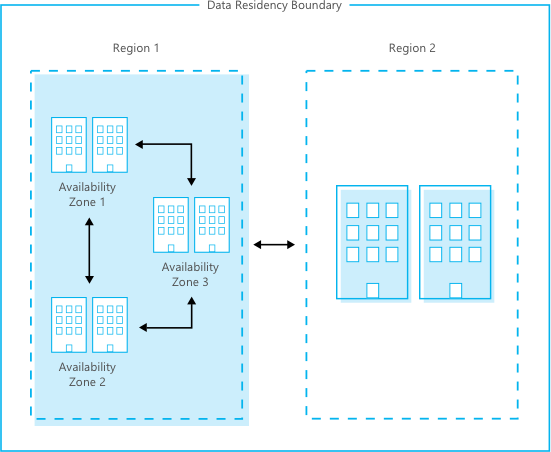
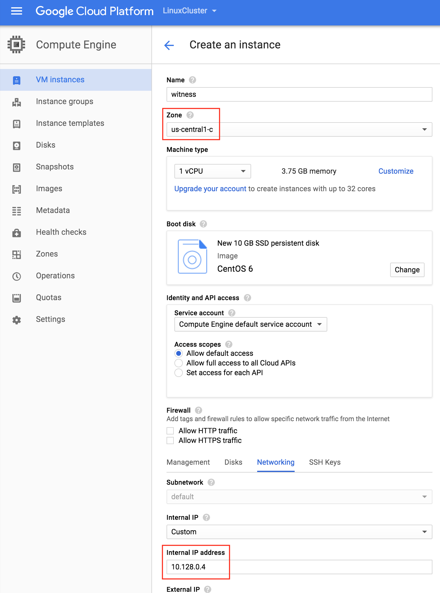

# cloud concepts

## Defining "The Cloud"

From [Wikipedia](https://en.wikipedia.org/wiki/Cloud_computing):

> Cloud computing is the on-demand availability of computer system resources, especially data storage and computing power, without direct active management by the user.

When you hear about "cloud", think of multiple buildings full of computers.

**What people maintaining the cloud do:**

* builds racks of TONS of computers
* connect all of those computers to electrical power
* make sure the heat generated from the computers doesn't cause fires that melt them
* repair broken computers
* design systems and plans to keep the computers running during disruptions

**What you do:**

* use the computers by clicking buttons or writing code


<details><summary>Public vs. Private Cloud</summary>

`Private Cloud`: Only people working for your company get to use the computers.

* some companies to know:
    - [rackspace](https://www.rackspace.com/)
    - [VMWare](https://www.vmware.com/)
    - [SAP](https://www.sap.com/products/hana-enterprise-cloud.html)

`Public Cloud`: Many organizations can pay to use the computers.

</details>

<details><summary>Cloud Platform vs. Cloud Services</summary>

`Cloud Infrastructure`: You can pay to reserve storage and compute and do anything you want with them.

Examples:

* [Amazon Web Services (AWS)](https://aws.amazon.com/)
* [Google Cloud Platform (GCP)](https://cloud.google.com/)
* [Microsoft Azure](https://azure.microsoft.com/en-us/)
* [DigitalOcean](https://www.digitalocean.com/)
* [Alibaba Cloud](https://us.alibabacloud.com/)

`Cloud Services`: Services that you interact with over the internet, but which don't allow to run arbitrary code.

Examples:

* [GitHub](https://github.com/)
* [SalesForce CRM](https://www.salesforce.com/ap/cloudcomputing/)
* [WorkDay](https://www.workday.com/)

This can get extra confusing, because the biggest `Cloud Infrastructture` companies also offer many `Cloud Services`. For examples, Google has a `Cloud Infrastructure` (GCP) and many `Cloud Services` ([GMail](https://www.google.com/gmail/about/), [Google Drive](https://www.google.com/docs/about/), etc.


</details>

<details><summary>How Cloud Infrastructure works</summary>

Companies that sell cloud infrastructure are telling their customers:

> Let us handle the hard stuff. We'll set up the data centers, puts lots of different types of computers and storage in them, and make sure your code and data are accessible.

> ...even if a bunch of fiber-optic cables are damaged by construction


> ...or one of the data centers burns down


*source: [IWGCR](http://iwgcr.org/fire-destroys-wisconsin-data-center/)*

Infrastructure providers set up multiple data centers in different geographic areas, and carefully choose their locations to minimize the risk of a single event like a natural disaster destroying multiple data centers.

The terminology is a bit different from cloud provider to cloud provider, but understanding the AWS terms will give you a good idea of how this works.

* `Availability Zone`: One or more data centers that are very close to each other. Communication between computers within an availability zone is fast and cheap.
* `Region`: A large geographic area with at least 3 `Availability Zones`. Communication between two `Availability Zones` within a `Region` is faster and cheaper than communication between `Availability Zones` in different `Regions`.
* `Backbone Network`: A physical network (think a LOT of fiber-optic cable) which connects Availability Zones within and between regions.
    - This infrastructure is only used for the Cloud Infrastructure provider's traffic, so the provider can sell privileged access to it and can make better guarantees about its speed, reliability, and security (compared to the internet).



These options allow people to create systems which are `Highly Available`. In short, a system is `Highly Available` if itt can be proven that the system will continue to operate correctly even if some of the computers it uses fail.

The relatively low cost of achieving `High Availability` is a major benefit of the public cloud compared to private clouds, and it is one major reason that `Cloud Infrastructure` providers invest so much in building Availability Zones and Regions.

**AWS**


*source: [AWS Global Infrastructure](https://aws.amazon.com/about-aws/global-infrastructure/)*

**Azure**


*source: [Azure Global Infrastructure](https://azure.microsoft.com/en-us/global-infrastructure/regions/)*

**GCP**


*source: [Google Cloud locations](https://cloud.google.com/about/locations)*

</details>

<details><summary>Provisioning Cloud Infrastructure</summary>

The act of reserving some infrastructure is often called `provisioning`. In a `Private Cloud` setting, it means you literally have to buy computers, storage media, wiring, and other equipment.
    
In the public cloud, "provisioning" involves sending requests over the internet to claim access to resources that the `Cloud Infrastructure` provider maintains in their data centers.
    
This could be done by clicking buttons in a console:
    


or by running code with a client library or command-line tool
 
```shell
gcloud \
    compute instances \
    create \
        example-instance \
        --zone us-central1-f
```

</details>

<details><summary>Infrastructure as Code</summary>

The examples above are *imperative* code.
    
**Imperative Code**
    
* provision 1 virtual machine with 100 GB of storage and 32 GB of RAM in the us-east-1 region
* set firewall rules on that virtual machine
* open port 80 on that virtual machine
    
**Declarative Code**
  
* Make sure that a virtual machine exists with certain firewall rules and port 80 open
    
With declarative code, instead of saying "do this, then this, then this", you say "do whatever you have to to make this true".
    
It's like when you place you an order at a drive-thru. You don't say "take the burgers out of the freezer and put them on the grill, drop some frieds in the oil, take the burger out and put it on a bun...". You *declare* what you want, and when you show up at the window that thing is true.
    
In the world of `Cloud Infrastructure`, using *declarative* tools to be sure that infrastructure exists is referred to as "infrastructure-as-code". This typically looks like writing up a *template*, like this:
    
    
```shell
resource "digitalocean_droplet" "mywebserver" {
  ssh_keys           = [12345678]         # Key example
  image              = "${var.ubuntu}"
  region             = "${var.do_ams3}"
  size               = "s-1vcpu-1gb"
  private_networking = true
  backups            = true
  ipv6               = true
  name               = "mywebserver-ams3"

  provisioner "remote-exec" {
    inline = [
      "export PATH=$PATH:/usr/bin",
      "sudo apt-get update",
      "sudo apt-get -y install nginx",
    ]

    connection {
      type     = "ssh"
      private_key = "${file("~/.ssh/id_rsa")}"
      user     = "root"
      timeout  = "2m"
    }
  }
} 
```
    
</details>

<details><summary>Serverless</summary>

In the examples so far, you've learned to think about `Cloud Infrastructure` as "some computers someone else owns".

In that setting, it's true that you don't own the computer, but you still have to think about where it is once your provision it. You have to install software on it, deal with the details of making it available for communication with other computers, and handle the case w here it fails.

A new model has emerged in recent years which allows you to build systems where you don't have to care about the underlying computers at all. This is called `Serverless`.


Look at the example above. You configure services like:

* Amazon CloudFront: make your application available via a friendly name like "mywebsite.com"
* Amazon API Gateway: organize different parts of the application that respond to requests, and handle authenticat
* Amazon Lambda: call some code on-demand and return the result
* Amazon S3: store data reliably and make it available for others to access

None of those services require you to know about the underlying computers that power them! This is more of that "declarative" model discussed earlier. You say what you want to happen (e.g. for your code to run when asked), and the infrastructure handles the details.

</details>
