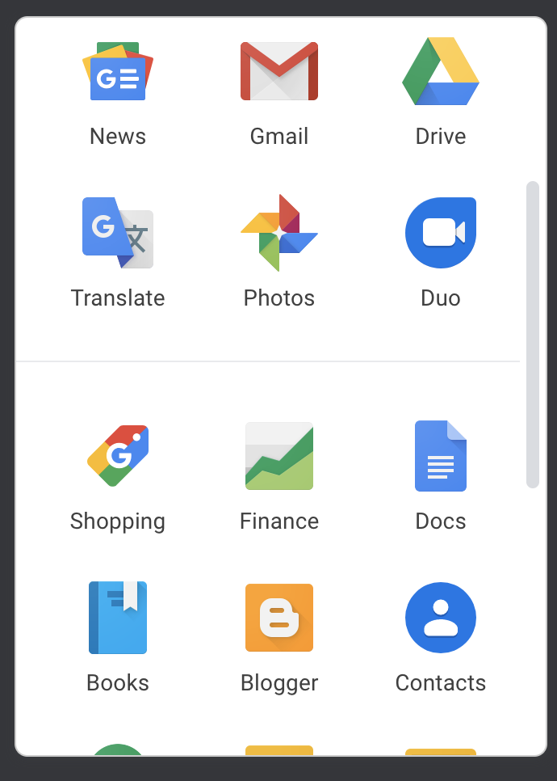
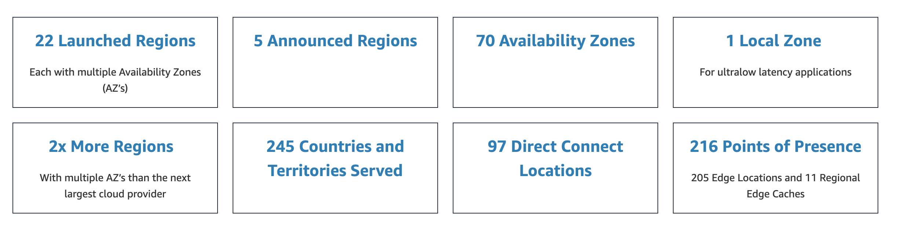
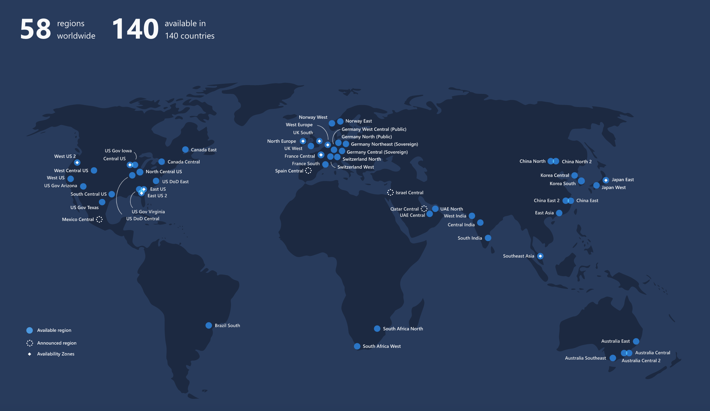
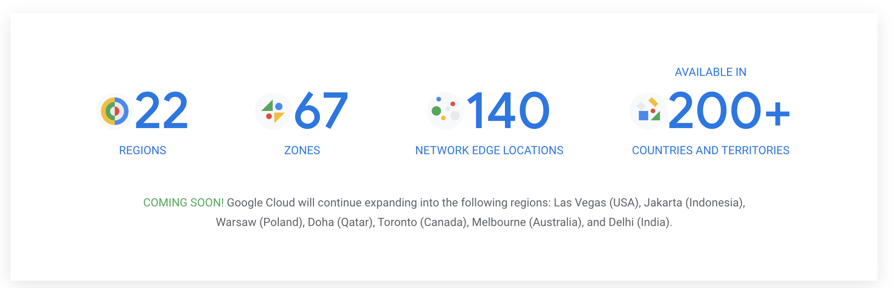

# cloud concepts

## Defining "The Cloud"

From [Wikipedia](https://en.wikipedia.org/wiki/Cloud_computing):

> Cloud computing is the on-demand availability of computer system resources, especially data storage and computing power, without direct active management by the user.

When you hear about "cloud", think of multiple buildings full of computers.

**What people maintaining the cloud do:**

* builds racks of TONS of computers
* connect all of those computers to electrical power
* make sure the heat generated from the computers doesn't cause fires that melt them
* repair broken computers
* design systems and plans to keep the computers running during disruptions

**What you do:**

* use the computers by clicking buttons or writing code

Public vs. Private Cloud

`Private Cloud`: Only people working for your company get to use the computers.

* some companies to know:
    - [rackspace](https://www.rackspace.com/)
    - [VMWare](https://www.vmware.com/)
    - [SAP](https://www.sap.com/products/hana-enterprise-cloud.html)

`Public Cloud`: Many organizations can pay to use the computers.

### Cloud Platform vs. Cloud Services

`Cloud Infrastructure`: You can pay to reserve storage and compute and do anything you want with them.

Examples:

* [Amazon Web Services (AWS)](https://aws.amazon.com/)
* [Google Cloud Platform (GCP)](https://cloud.google.com/)
* [Microsoft Azure](https://azure.microsoft.com/en-us/)
* [DigitalOcean](https://www.digitalocean.com/)
* [Alibaba Cloud](https://us.alibabacloud.com/)

`Cloud Services`: Services that you interact with over the internet, but which don't allow to run arbitrary code.

Examples:

* [GitHub](https://github.com/)
* [SalesForce CRM](https://www.salesforce.com/ap/cloudcomputing/)
* [WorkDay](https://www.workday.com/)

This can get extra confusing, because the biggest `Cloud Infrastructture` companies also offer many `Cloud Services`. For examples, Google has a `Cloud Infrastructure` (GCP) and many `Cloud Services` ([GMail](https://www.google.com/gmail/about/), [Google Drive](https://www.google.com/docs/about/), etc.

*source: [AWS Global Infrastructure](https://aws.amazon.com/about-aws/global-infrastructure/)*

*source: [Azure Global Infrastructure](https://azure.microsoft.com/en-us/global-infrastructure/regions/)*

*source: [Google Cloud locations](https://cloud.google.com/about/locations)*

