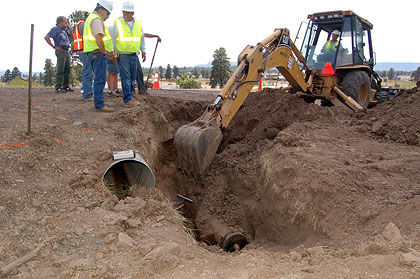

# cloud concepts

## Defining "The Cloud"

From [Wikipedia](https://en.wikipedia.org/wiki/Cloud_computing):

> Cloud computing is the on-demand availability of computer system resources, especially data storage and computing power, without direct active management by the user.

When you hear about "cloud", think of multiple buildings full of computers.

**What people maintaining the cloud do:**

* builds racks of TONS of computers
* connect all of those computers to electrical power
* make sure the heat generated from the computers doesn't cause fires that melt them
* repair broken computers
* design systems and plans to keep the computers running during disruptions

**What you do:**

* use the computers by clicking buttons or writing code

Public vs. Private Cloud

`Private Cloud`: Only people working for your company get to use the computers.

* some companies to know:
    - [rackspace](https://www.rackspace.com/)
    - [VMWare](https://www.vmware.com/)
    - [SAP](https://www.sap.com/products/hana-enterprise-cloud.html)

`Public Cloud`: Many organizations can pay to use the computers.

Cloud Platform vs. Cloud Services

`Cloud Infrastructure`: You can pay to reserve storage and compute and do anything you want with them.

Examples:

* [Amazon Web Services (AWS)](https://aws.amazon.com/)
* [Google Cloud Platform (GCP)](https://cloud.google.com/)
* [Microsoft Azure](https://azure.microsoft.com/en-us/)
* [DigitalOcean](https://www.digitalocean.com/)
* [Alibaba Cloud](https://us.alibabacloud.com/)

`Cloud Services`: Services that you interact with over the internet, but which don't allow to run arbitrary code.

Examples:

* [GitHub](https://github.com/)
* [SalesForce CRM](https://www.salesforce.com/ap/cloudcomputing/)
* [WorkDay](https://www.workday.com/)

This can get extra confusing, because the biggest `Cloud Infrastructture` companies also offer many `Cloud Services`. For examples, Google has a `Cloud Infrastructure` (GCP) and many `Cloud Services` ([GMail](https://www.google.com/gmail/about/), [Google Drive](https://www.google.com/docs/about/), etc.

How Cloud Infrastructure works

Companies that sell cloud infrastructure are telling their customers:

> Let us handle the hard stuff. We'll set up the data centers, puts lots of different types of computers and storage in them, and make sure your code and data are accessible.

> ...even if a bunch of fiber-optic cables are damaged by construction

> ...or one of the data centers burns down

*source: [IWGCR](http://iwgcr.org/fire-destroys-wisconsin-data-center/)*

> ...

Infrastructure providers set up multiple data centers in different geographic areas, and carefully choose their locations to minimize the risk of a single event like a natural disaster destroying multiple data centers.

The terminology is a bit different from cloud provider to cloud provider, but understanding the AWS terms will give you a good idea of how this works.

* `Availability Zone`: One or more data centers that are very close to each other. Communication between computers within an availability zone is fast and cheap.
* `Region`: A large geographic area with at least 3 `Availability Zones`. Communication between two `Availability Zones` within a `Region` is faster and cheaper than communication between `Availability Zones` in different `Regions`.
* `Backbone Network`: A physical network (think a LOT of fiber-optic cable) which connects Availability Zones within and between regions.
    - This infrastructure is only used for the Cloud Infrastructure provider's traffic, so the provider can sell privileged access to it and can make better guarantees about its speed, reliability, and security (compared to the internet).

**AWS**

*source: [AWS Global Infrastructure](https://aws.amazon.com/about-aws/global-infrastructure/)*

**Azure**

*source: [Azure Global Infrastructure](https://azure.microsoft.com/en-us/global-infrastructure/regions/)*

**GCP**

*source: [Google Cloud locations](https://cloud.google.com/about/locations)*

