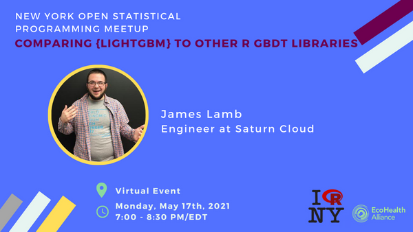

# Comparing `{lightgbm}` to other GBDT libraries

## Description

> In this talk, attendees will learn about LightGBM, a popular gradient boosted decision tree (GBDT) framework. The talk begins with an overview of LightGBM and the features that allow it to be fast without sacrificing accuracy. After those fundamentals, attendees will learn about how {lightgbm} compares to two other popular GBDT projects with R packages: {catboost} and {xgboost}. That portion of the talk will cover why you might choose one library over the others, and will discuss issues ranging from ease-of-installation and data loading to algorithmic details like handling of sparse features and strategies used to decide which splits to evaluate.

## demo code

### run without docker

`{lightgbm}` and `{xgboost}` can be installed from CRAN.

```r
install.packages(c("lightgbm", "xgboost"), repos = "https://cran.r-project.org")
```

`{catboost}` must be installed from GitHub.

```r
library(remotes)
remotes::install_github(
    repo = 'catboost/catboost'
    , subdir = 'catboost/R-package'
    , ref = "v0.25.1"
)
```

### run with docker

You can run all of the example code for this talk using a containerized version of RStudio server.

1. Build the image if you haven't already.

    ```shell
    make build
    ```

2. Run RStudio

    ```shell
    make run
    ```

3. Navigate to `127.0.0.1:8787` in your web browser

    ```shell
    docker run --rm \
        -v $(pwd):/opt/demo \
        -p 127.0.0.1:8787:8787 \
        -e DISABLE_AUTH=true \
        rocker/rstudio:4.0.5
    ```

### Updating the Dependencies slide

One slide in the talk compares the number of dependencies in `{catboost}`, `{lightgbm}`, and `{xgboost}`. To get a list of all recursive dependencies (e.g. dependencies of dependencies of dependencies...), install `{pkgnet}` from CRAN.

```r
install.packages("pkgnet", repos = "https://cran.r-project.org")
```

Then run the following. Change `package_name` and `dep_types` to get the different combinations of package name and dependency types.

```r
library(pkgnet)

package_name <- "lightgbm"
report_path <- sprintf("/home/rstudio/demo/%s.html", package_name)

pkgnet::CreatePackageReport(
    pkg_name = package_name
    , report_path = report_path
    , pkg_reporters = list(
        DependencyReporter$new(dep_types = c("Depends"))
    )
)
```

## Where this talk has been given:

* (virtual) [New York Open Statistical Programming Meetup](https://www.meetup.com/nyhackr/events/277831968), May 2021 ([video](https://www.youtube.com/watch?v=z64JFJQR_J0) | [slides](https://docs.google.com/presentation/d/15KKUrzTrFVmT-XmjXLfLS1R0pP5r8qenSZHGzVg1LKI/edit?usp=sharing))

## Promo Images


