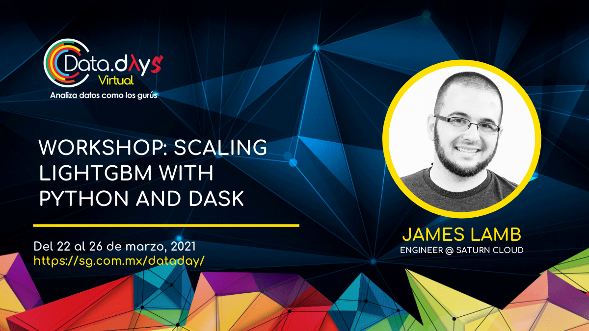
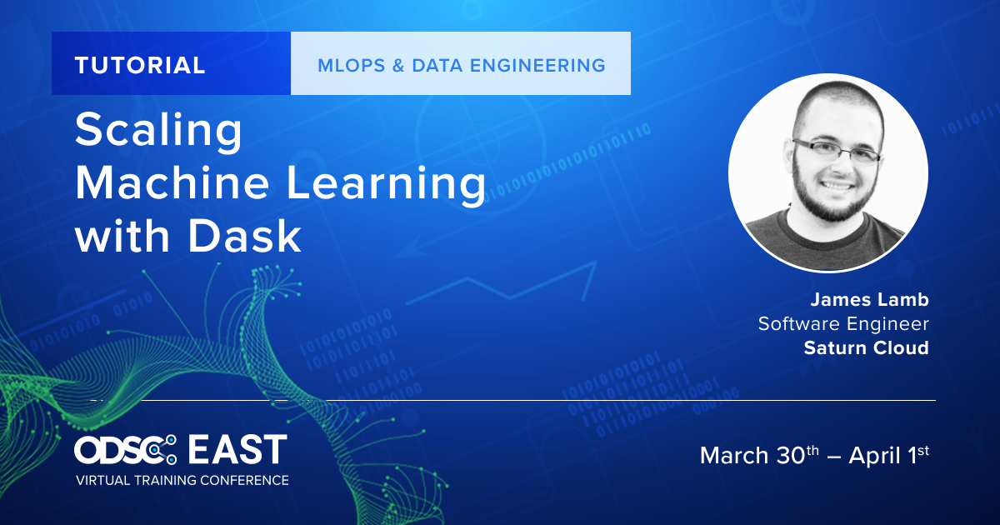

# Scaling Machine Learning With Python and Dask

## Description

> In this talk, attendees will get an introduction to Dask, a distributed computing framework in the PyData ecosystem. The first half of the talk will describe the current state of the project and its ecosystem including distributed data collections, cloud deployment options, distributed machine learning projects, and workflow orchestration. The second half of the talk will be a live demo showing the programming model for machine learning on Dask, with specific examples using LightGBM.

**NOTE:** Versions of this talk have also been given under the title `"Scaling LightGBM with Python and Dask"`.

## Demo code

The demo code from this talk is available at https://github.com/jameslamb/lightgbm-dask-testing.

If you'd prefer to not build docker images and run containers yourself, you can also try the LightGBM quickstart in Saturn Cloud Community: https://www.saturncloud.io/s/

## Where this talk has been given:

* (virtual) [Chicago Cloud Conference](https://www.chicagocloudconference.com/), September 2020 ([slides](https://docs.google.com/presentation/d/1JOKOic-zIqp20vDA8_Jx2XrQ65edowxGb9RiN5b4WY8/edit?usp=sharing) | [video](https://www.youtube.com/watch?v=qglSZktDz40&t=1800s))
* (virtual) [PyData Montreal](https://www.meetup.com/PyData-MTL/events/275543323/), January 2021 ([slides](https://docs.google.com/presentation/d/1djy022s4t6HbPxZEcNuFxbJJMQMW9NQCBluvAA9NK-Y/edit?usp=sharing) | [video](https://www.youtube.com/watch?v=vajaT1FNP6I))
* (virtual) [Chicago ML](https://www.meetup.com/Chicago-ML/events/275314043/), January 2021 ([slides](https://docs.google.com/presentation/d/1NNVcd0wQe5Dz8hbbV36065AczRL_Ugre0NaPa1BTSRw/edit?usp=sharing) | [video](https://www.youtube.com/watch?v=hK4fiXz8zXM))
* (virtual) [Orlando ML & DS](https://www.meetup.com/Orlando-MLDS/events/276267258/), February 2021 ([slides](https://docs.google.com/presentation/d/1Z0lDBYIIiLMxypP_FEauyQJg1fzFWMsk2YsDZs4vKyQ/edit?usp=sharing))
* (virtual) [DataDays 2021](https://sg.com.mx/dataday/session/workshop-scaling-lightgbm-with-python-and-dask/), March 2021 ([slides](https://docs.google.com/presentation/d/16P-kTtCIBTe9LnEm-7kM-pZwVKrdiTSeeBOL7yoHYfU/edit?usp=sharing))
* (virtual) [ODSC East 2021](https://odsc.com/speakers/scaling-machine-learning-with-dask/), March 2021 ([slides](https://docs.google.com/presentation/d/12ZG8miqTldOpprrjKw6G7vP-PP2Xs0e8mjc2qwPCt6I/edit?usp=sharing) | [video](https://www.youtube.com/watch?v=8kKVrJC7op4))

## Promo Images

